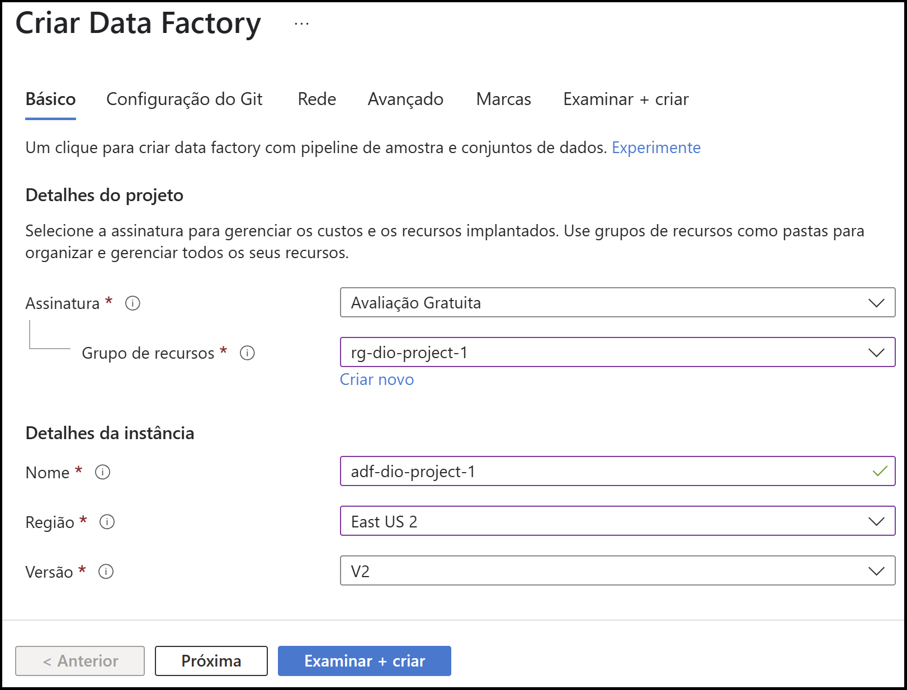
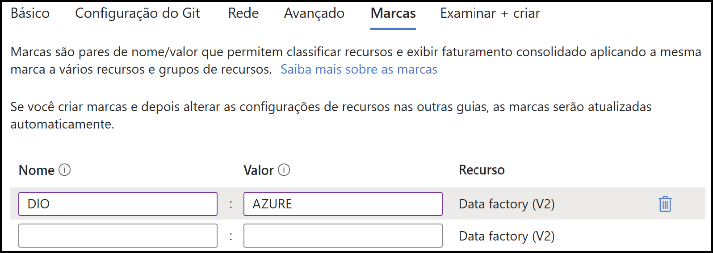
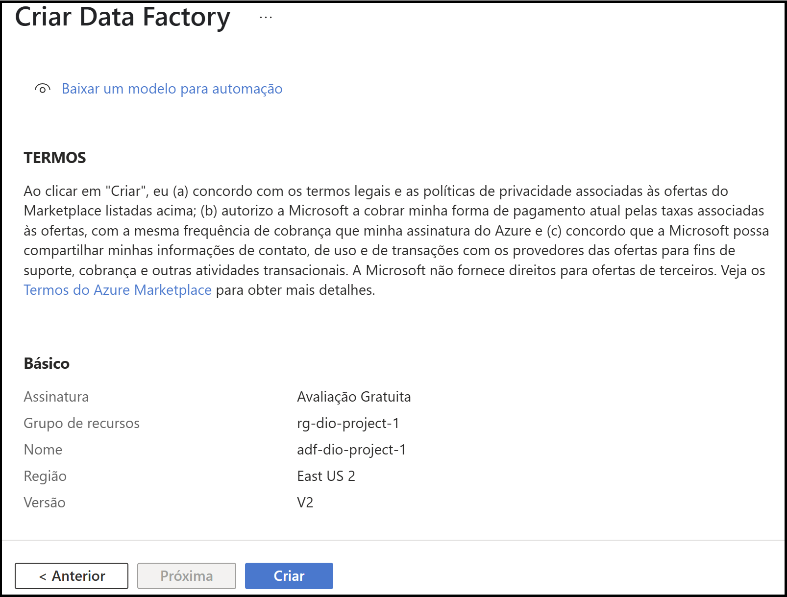
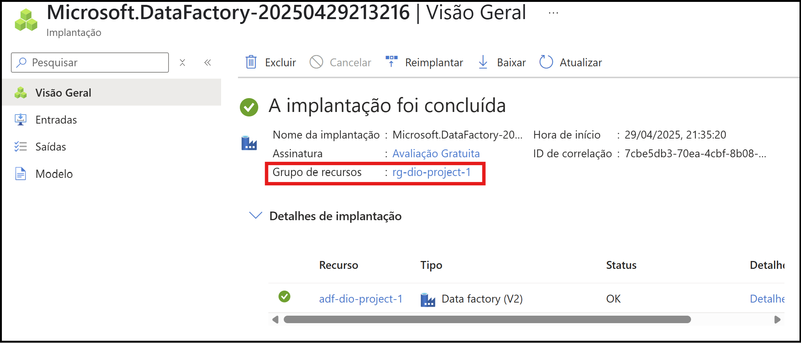

# Desafio de Projeto 1: Monitoramento de Custos no Azure com Data Factory

Este projeto faz parte do bootcamp **Microsoft AI for Tech - Azure Databricks**, oferecido pela **DIO** em parceria com a **Microsoft**.

## 🎯 Objetivo

Neste desafio, configuramos um ambiente no **Azure** para iniciar um monitoramento básico de custos e recursos, com foco na criação de um recurso do **Azure Data Factory** e na personalização de dashboards no portal.

Embora o projeto tenha como título "Monitoramento de Custos com Azure Data Factory", o foco da atividade prática esteve na **familiarização com o portal Azure**, criação de recursos básicos e configuração visual de **dashboards personalizados** -- sem a criação de pipelines ou uso direto do Data Factory para monitoramento de custos.

## 💡 O que você vai encontrar neste repositório

- Criação de uma **conta gratuita** no Azure (com crédito inicial de US$200);
- Criação de um **grupo de recursos** e do recurso **Azure Data Factory**;
- Configuração de um **dashboard personalizado** no portal do Azure;
- Organização dos recursos com **boas práticas de nomenclatura** e **uso de tags**;
- Exploração das opções de **visualização de custos** dentro do portal.

## 🛠️ Passo a passo da implementação

### 1. Criação da conta gratuita
Para iniciar o projeto de monitoramento de custos do Azure Data Factory, o primeiro passo foi criar uma conta gratuita na plataforma Azure. Utilize o link oficial para criação da conta gratuita:

🔗 [Criar conta gratuita no Azure](https://azure.microsoft.com/pt-br/pricing/purchase-options/azure-account?icid=azurefreeaccount)

A conta gratuita oferece:

- Acesso ao catálogo completo de serviços do Azure até os limites do plano gratuito;

- Crédito de US$ 200 (aproximadamente R$ 1.150) para utilizar em qualquer serviço do Azure no período de 30 dias.

Durante a inscrição, é necessário informar um cartão de crédito para verificação da identidade. O valor é verificado na hora, mas o débito é estornado logo em seguida, sem cobrança adicional.

---

### 2. Criação de recursos
Após a criação da conta gratuita, o próximo passo é aprender a **criar recursos** dentro do portal Azure. Isso pode ser feito de duas maneiras principais:

#### ✅ Opção 1: Usar a Barra de Pesquisa
- No topo do portal, utilize a barra de pesquisa para **digitar o nome do recurso** desejado (por exemplo, *Data Factory*, *Storage Account*, etc.).
- Clique no resultado correspondente e siga para a criação do recurso.

#### ✅ Opção 2: Usar o Menu "Criar um recurso"
- No menu lateral, clique em **"Criar um recurso"**.
- Você pode navegar pelas **categorias de serviços** como:
  - **IA + Machine Learning**
  - **Banco de Dados**
  - **Rede**
  - **Computação**, entre outras.
- Também é possível utilizar a barra de pesquisa dessa tela para procurar diretamente pelo recurso desejado.

---

### 3. Criação de Dashboard (Painel) no Azure

Após criar os recursos necessários, é possível configurar um **dashboard personalizado** (ou painel) para visualizar métricas, status e outras informações importantes logo na tela inicial do portal.

#### Onde encontrar
Os dashboards ficam localizados no **Hub de Painel**, acessível pelo menu lateral do portal Azure. Por padrão, existe um painel chamado **"Meu dashboard"**, que é privado e já vem criado automaticamente.

#### Como criar um novo painel
1. Acesse o **Hub de Painel**.
2. Clique em **“+ Novo painel”** para criar um painel do zero.
3. Dê um nome ao seu painel e clique em **"Editar"** para começar a personalizá-lo.
4. Use a opção **"Adicionar bloco"** para inserir visualizações como:
   - Métricas de uso e custo de recursos;
   - Informações de monitoramento;
   - Gráficos e alertas de serviços como o Azure Data Factory;
   - Links rápidos para recursos frequentemente utilizados.

#### Fixando recursos no painel
Você também pode fixar visualizações diretamente da página de um recurso. Basta clicar no ícone de pin (📌) em qualquer gráfico, métrica ou painel de monitoramento para adicioná-lo ao dashboard selecionado.

Isso permite que, ao acessar o portal, você veja imediatamente os dados e recursos mais relevantes para o seu projeto.

---

### 4. Criação do Recurso Azure Data Factory

Para iniciar o monitoramento de custos do Data Factory, é necessário primeiro criar esse recurso no portal Azure.

#### Passo a passo

1. Acesse o recurso **Data Factories** e clique em **"Criar"**.
2. Todo recurso criado no Azure exige uma **assinatura** ativa. No nosso caso, usamos a assinatura **Avaliação Gratuita**, como mostrado abaixo:

3. Em seguida, criamos um **Grupo de Recursos**, que é uma forma organizada de agrupar e gerenciar os recursos relacionados a um mesmo projeto.  
   Por exemplo: se estivermos montando um ambiente de dados com Data Factory, Data Lake e Synapse Analytics, podemos alocar todos esses recursos em um mesmo grupo.  
   Isso facilita o monitoramento, a manutenção e até a exclusão em lote, se necessário.

4. É recomendável seguir uma **nomenclatura padrão** para facilitar a identificação dos recursos. A Microsoft fornece um guia com recomendações de abreviações para diferentes tipos de serviço:

    🔗 [Recomendações de abreviações para recursos do Azure](https://learn.microsoft.com/pt-br/azure/cloud-adoption-framework/ready/azure-best-practices/resource-abbreviations)

      - Para o Data Factory, a sigla recomendada é `adf`.
      - Para o grupo de recursos, utilizamos `rg`.

      **Nome escolhido para este projeto:** `adf-dio-project-1`

5. **Região:** selecionamos **East US 2**, uma das regiões mais baratas, já que o projeto é para fins de aprendizado. Em projetos reais, a escolha da região depende de requisitos legais e técnicos - por exemplo, instituições financeiras brasileiras normalmente exigem que os dados permaneçam no Brasil.

#### Outras configurações

- **Controle de código-fonte (Git):** Na aba de configuração do Git, selecionamos a opção **"Configurar o Git mais tarde"**. Essa integração pode ser feita posteriormente, se desejado.
- **Rede, criptografia e configurações avançadas:** mantivemos as configurações padrão para este projeto.
- **Marcas (Tags):** Marcar os recursos é uma prática recomendada para ajudar no monitoramento, organização por equipes ou centros de custo, e controle de orçamento.  
  Por exemplo, podemos adicionar uma marca com:
  - Nome: `DIO`
  - Valor: `AZURE`

#### Finalização e validação

Após preencher as configurações, avançamos para a aba **"Examinar + criar"**.

- O portal realiza uma **validação automática** das configurações.
- Após a validação, temos a opção de **baixar o modelo de automação**, que contém todos os parâmetros definidos em formato de código (template ARM), útil para reproduzir a criação do recurso via script ou CI/CD.

Por fim, clicamos em **"Criar"** para iniciar a implantação.

#### Conclusão da criação

Ao final da implantação, visualizamos a tela de sucesso e podemos acessar os **detalhes da implantação**, incluindo o recurso e o grupo de recursos criados.

---

