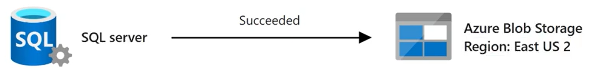
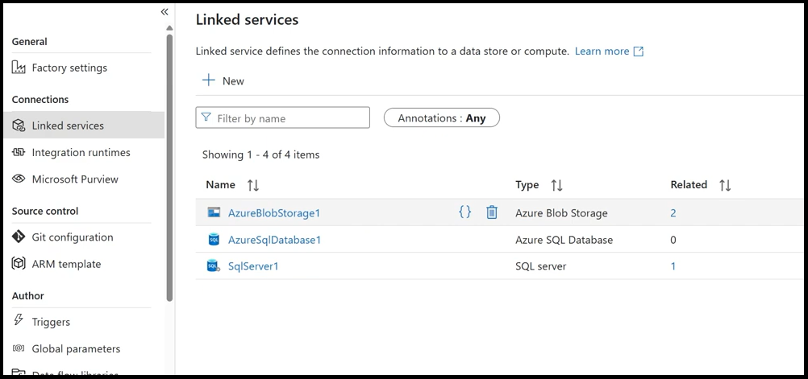
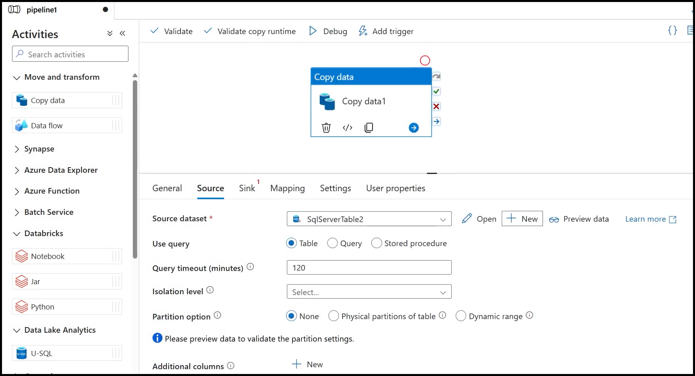
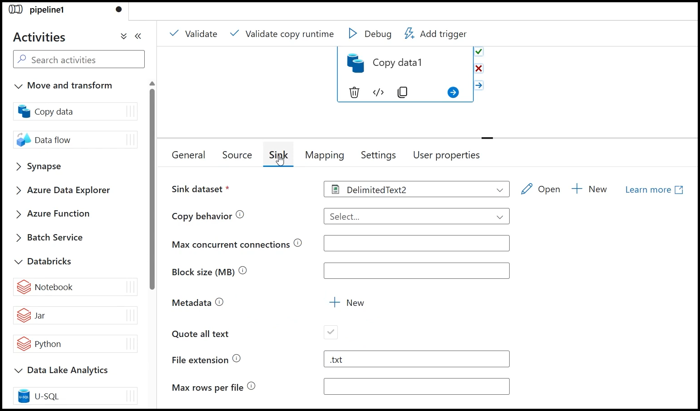
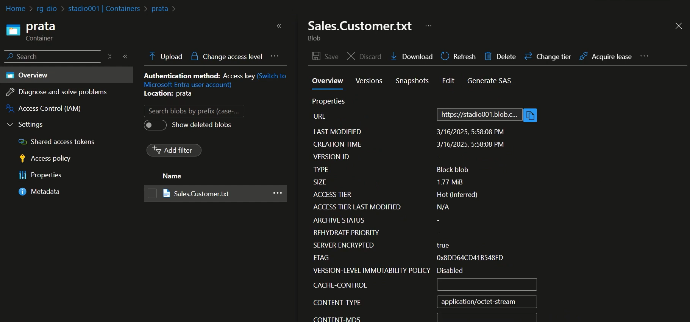

# Desafio de Projeto 2: Cópia de Dados de SQL On-Premises para Blob Storage com Azure Data Factory

Este projeto faz parte do bootcamp **Microsoft AI for Tech - Azure Databricks**, promovido pela **DIO** em parceria com a **Microsoft**.

## 🎯 Objetivo

O objetivo desta atividade prática é simular um processo de **redundância e movimentação de dados** utilizando o **Azure Data Factory**. O fluxo consiste em copiar dados de uma tabela SQL Server on-premises para um **container Blob Storage**, estruturando os arquivos em formato `.txt` dentro da **camada prata** de um Data Lake.

## 🛠️ Etapas do Projeto

### 1. Configurações iniciais no Data Factory

- Acesse o menu lateral **"Gerenciar"** dentro do Azure Data Factory.
- Configure os **Serviços Vinculados (Linked Services)**:
  
  #### a) SQL Server On-Premises
  - Criar um recurso de **Integration Runtime** para acessar dados locais.
  - Criar um **Linked Service** apontando para o SQL Server local (utiliza o IR acima).
  
  #### b) Azure SQL Database
  - Criar um banco de dados no Azure (opcional).
  - Criar um **Linked Service** para esse banco (sem necessidade de IR).

  #### c) Blob Storage
  - Criar um recurso do tipo **Storage Account**.
  - Criar **containers** para as camadas do Data Lake:
    - `bronze/`
    - `silver/`
    - `gold/`
  - Criar um **Linked Service** apontando para o Blob Storage.

---

### 2. Criação do Pipeline de Cópia

- Acesse o menu lateral **"Autor"** no Data Factory e clique em **"Pipelines"** > **Novo pipeline**.
- Em **Atividades**, selecione a atividade **"Copy data"** (Mover e Transformar).

#### Configuração da atividade:

- **Origem:**
  - Criar um **Dataset** do tipo SQL Server.
  - Associar ao Linked Service criado anteriormente.
  - Selecionar a tabela que será copiada (on-premises).

- **Destino:**
  - Criar um **Dataset** do tipo **DelimitedText**.
  - Associar ao Linked Service do Blob Storage.
  - Definir o caminho de destino para a **camada prata**.
  - Escolher formato `.txt` com delimitadores apropriados.

---

### 3. Validação, Publicação e Execução

- Após configurar os datasets e os parâmetros de cópia:
  - Clique em **Validar** para verificar inconsistências.
  - Em seguida, **Publicar todas** as alterações.
  - Por fim, **Execute** o pipeline manualmente.

## 📁 Estrutura Esperada no Blob Storage

## 📌 Considerações Finais

Foi possível observar um cenário completo de integração entre ambientes **on-premises** e a **nuvem Azure**, incluindo:

- A estrutura mínima para ingestão de dados com o Azure Data Factory.
- O uso do **Integration Runtime** para conexões locais.
- A separação em **camadas de dados** para futuras arquiteturas de Data Lake.

## 🔗 Referências

- [Azure Data Factory - Visão Geral](https://learn.microsoft.com/pt-br/azure/data-factory/introduction)
- [Integration Runtime (IR) no Data Factory](https://learn.microsoft.com/pt-br/azure/data-factory/concepts-integration-runtime)
- [Linked Services no ADF](https://learn.microsoft.com/pt-br/azure/data-factory/concepts-linked-services?tabs=data-factory)
- [Datasets no ADF](https://learn.microsoft.com/pt-br/azure/data-factory/concepts-datasets-linked-services)

---