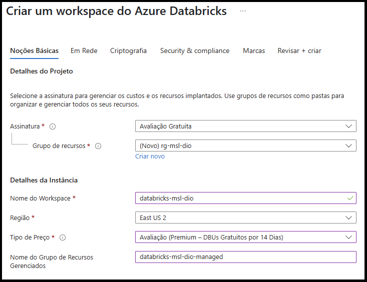
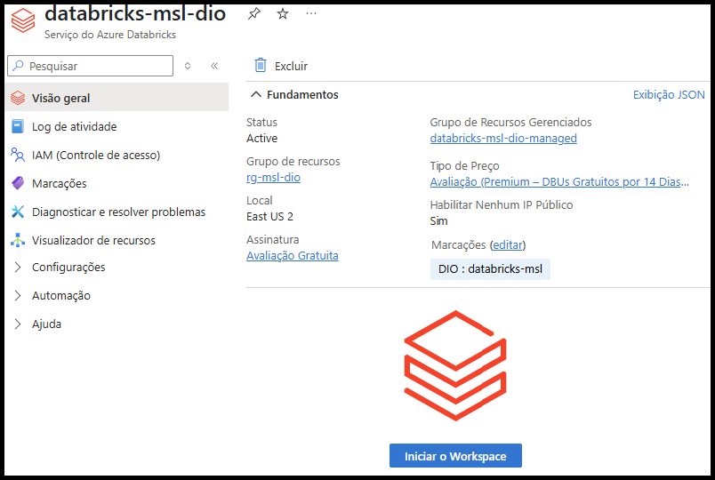
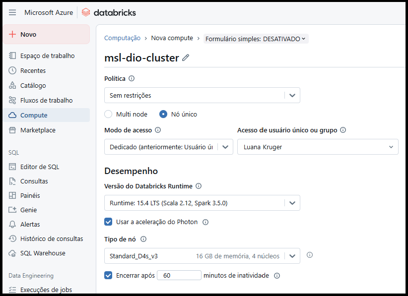
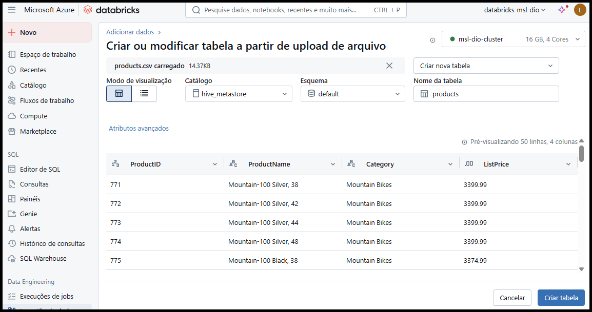
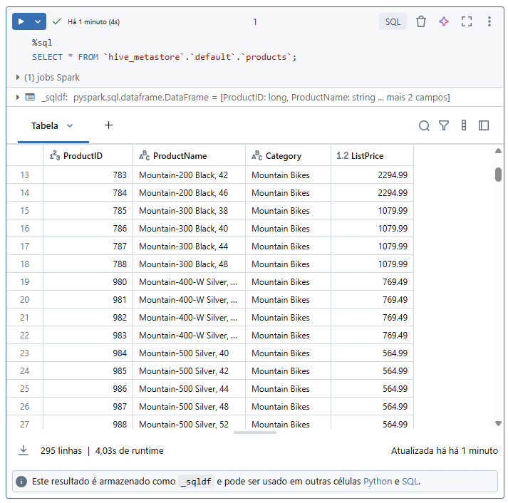
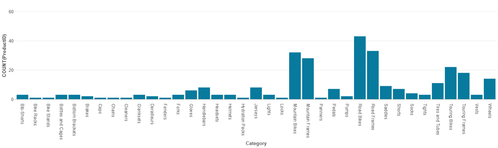
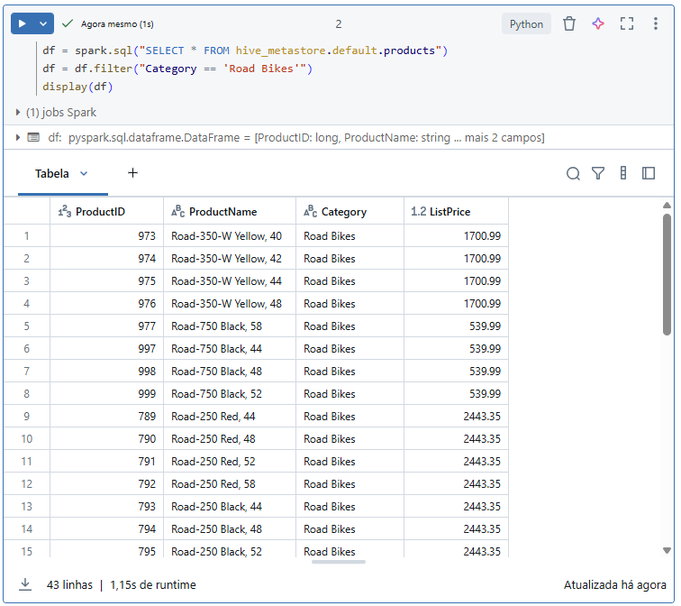

# Desafio de Projeto 3: Análise de Dados com Notebooks no Azure Databricks

Este projeto foi desenvolvido como parte do bootcamp **Microsoft AI for Tech - Azure Databricks**, com base no módulo prático [Explorar o Azure Databricks](https://learn.microsoft.com/pt-br/training/modules/explore-azure-databricks/) do Microsoft Learn.

## 🎯 Objetivo

O objetivo é provisionar um ambiente completo no **Azure Databricks**, criar um **cluster de processamento Spark**, carregar e explorar dados utilizando **notebooks**, realizar visualizações e aplicar consultas com **SQL** e **PySpark**.


## 🛠️ Etapas do Projeto

### 1. Provisionamento do Workspace no Azure Databricks

O primeiro passo consiste na criação de um workspace do Azure Databricks diretamente pelo portal do Azure.

- Acesse o portal: [https://portal.azure.com](https://portal.azure.com)
- Crie um recurso do tipo **Azure Databricks** com as seguintes configurações:
  - **Assinatura:** Selecione sua assinatura do Azure (nesse caso é a Avalição Gratuita criada no Projeto 1)
  - **Grupo de recursos:** `rg-msl-dio`
  - **Nome do Workspace:** `databricks-msl-dio`
  - **Região:** East US 2
  - **Tipo de preço:** Avaliação gratuita (14 dias)
  - **Grupo de recursos gerenciados:** `databricks-msl-dio-managed`
  - **Marcas (tags):** Nome: `DIO` / Valor: `databricks-msl`

Após revisar as configurações, selecione **Revisar + Criar** e aguarde a conclusão da implantação. 

<p align="center">
 
</p>


### 2. Criação do Cluster

O Azure Databricks utiliza clusters Apache Spark para o processamento distribuído de dados. Nesta etapa, será criado um cluster de nó único para reduzir os recursos utilizados.

- Acesse o grupo de recursos `rg-msl-dio` e abra o workspace `databricks-msl-dio`.
- Clique em **Iniciar o Workspace** para abrir a interface do Databricks em nova aba.

<p align="center">
 
</p>

- No menu lateral esquerdo, clique em **(+) Novo** e selecione **Cluster** (pode estar dentro do submenu "Mais").
- Preencha as seguintes configurações:
  - **Nome do Cluster:** `msl-dio-cluster`
  - **Política:** Sem restrições
  - **Modo de Cluster:** Nó único
  - **Modo de Acesso:** Usuário único
  - **Versão do Databricks Runtime:** 13.3 LTS (Spark 3.4.1, Scala 2.12) ou superior
  - **Aceleração Photon:** Ativada
  - **Tipo de nó:** `Standard_D4s_v3` (compatível com a região East US 2 selecionada na criação do workspace do passo anterior)
  - **Encerrar após:** 60 minutos de inatividade

Aguarde a criação do cluster, o que pode levar alguns minutos.

<p align="center">
 
</p>


### 3. Carregamento dos Dados

Com o cluster criado, será feito o upload de um arquivo CSV contendo informações de produtos.

- Baixe o arquivo [products.csv](https://raw.githubusercontent.com/MicrosoftLearning/mslearn-databricks/main/data/products.csv) para o seu computador.
- No menu lateral do Databricks, clique em **(+) Novo** > **Adicionar ou carregar dados**.
- Selecione **Criar ou modificar tabela** e envie o arquivo `products.csv`.

Na tela de criação da tabela, selecione o cluster ativo no canto superior direito, escolha o catálogo `hive_metastore` e o esquema padrão. Nomeie a tabela como `products`.

<p align="center">
 
</p>


### 4. Criação do Notebook

Após a criação da tabela, será iniciado um notebook para consulta e visualização dos dados.

- No explorador de catálogo, após confirmar a criação da tabela `products`, clique em **Criar** > **Notebook**.
- Verifique se o notebook está conectado ao cluster criado anteriormente.
- Execute a célula gerada automaticamente, que recupera os dados da tabela.
- Aguarde a execução e visualize os resultados em formato tabular.

<p align="center">
 
</p>


### 5. Criação de Visualização Gráfica

Para explorar visualmente os dados, adicione uma visualização do tipo gráfico de barras:

- Acima da tabela de resultados, clique em **+** > **Visualização**
- Configure as opções:
  - **Tipo de visualização:** Bar (barra)
  - **Coluna X:** `Category`
  - **Coluna Y:** `ProductID` com agregação **Count**
- Salve a visualização.

<p align="center">
 
</p>


### 6. Análise com PySpark

Para usuários mais experientes com Spark, é possível trabalhar com **dataframes** em Python através do módulo **PySpark**.

- Abaixo da visualização, clique em **+ Código** para adicionar uma nova célula.
- Insira o código PySpark abaixo para filtrar produtos da categoria “Road Bikes”:

```python
 df = spark.sql("SELECT * FROM hive_metastore.default.products")
 df = df.filter("Category == 'Road Bikes'")
 display(df)
```

<p align="center">
 
</p>


### 7. Encerramento dos Recursos

Ao finalizar o uso do ambiente, acesse a aba **Compute**, selecione o cluster `msl-dio-cluster` e clique em **■ Encerrar** para evitar consumo de recursos.

Para evitar custos adicionais, também é recomendável excluir os recursos criados no Azure, caso não sejam mais necessários.


## 📄 Arquivo do Notebook

O notebook criado durante o projeto está disponível neste repositório:

📘 [`analise-produtos-spark.ipynb`](./analise-produtos-spark.ipynb)


## 🔗 Referências

* [Explorar o Azure Databricks - Microsoft Learn](https://learn.microsoft.com/pt-br/training/modules/explore-azure-databricks/)
* [Documentação oficial do Azure Databricks](https://learn.microsoft.com/pt-br/azure/databricks/)
* [Azure Databricks Exercises](https://microsoftlearning.github.io/mslearn-databricks/)


---