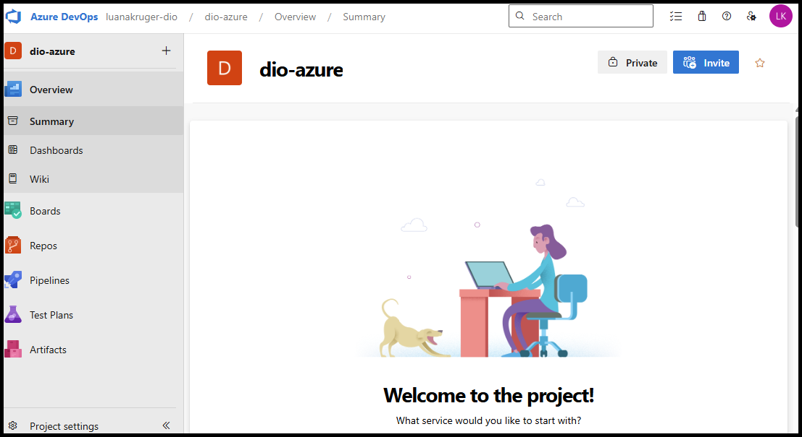
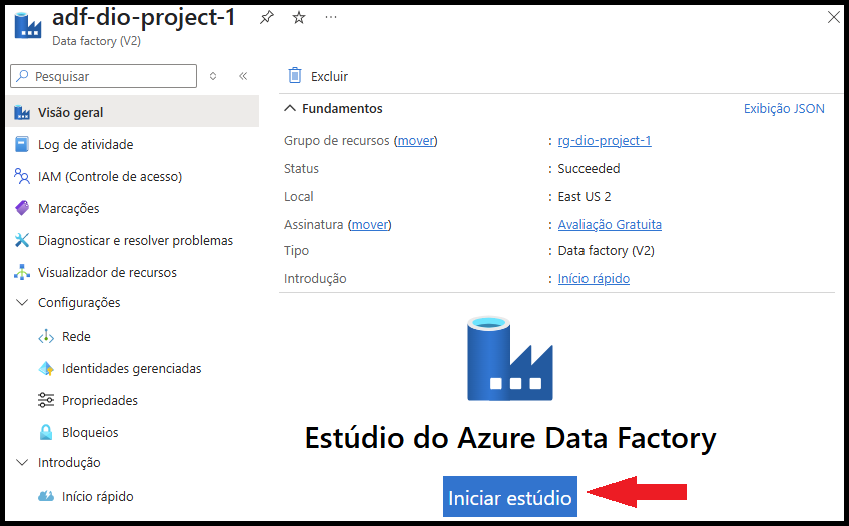
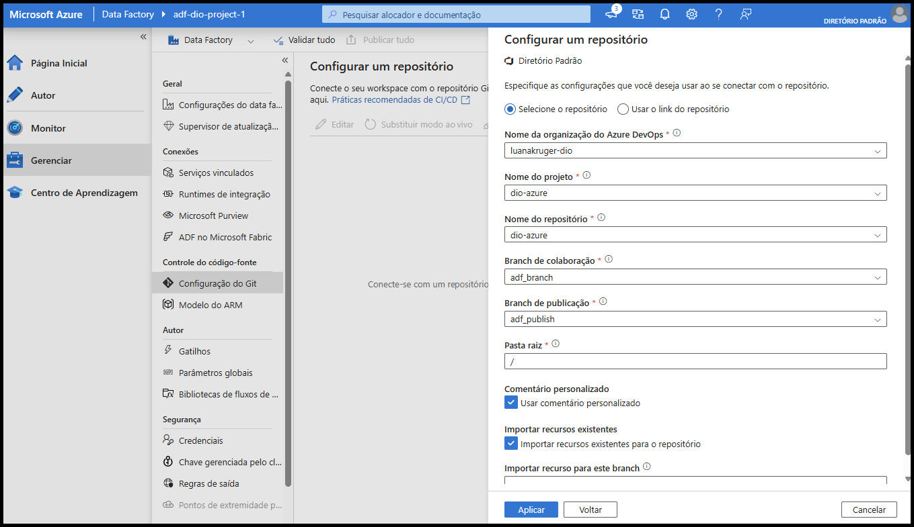
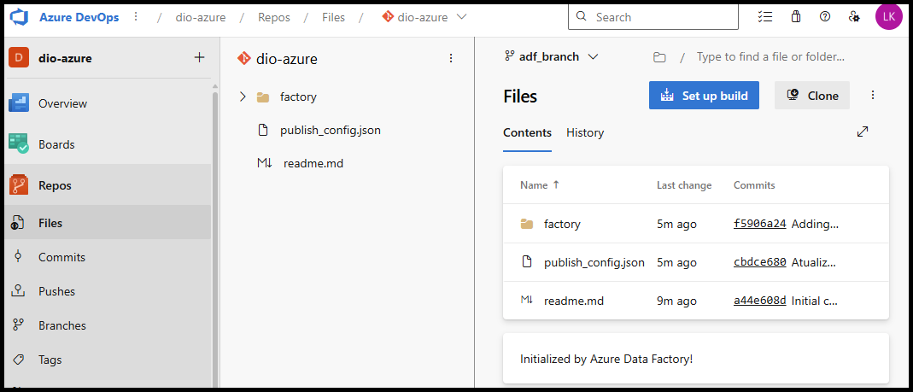

# Desafio de Projeto 4: Integração do Azure Data Factory com Azure DevOps

Este projeto faz parte do bootcamp **Microsoft AI for Tech - Azure Databricks** e tem como objetivo demonstrar a integração entre o **Azure Data Factory (ADF)** e o **Azure DevOps**, permitindo o versionamento automatizado de pipelines e artefatos, controle de alterações e governança do ciclo de vida das soluções de dados.

## 🎯 Objetivo

O foco do projeto é configurar o ADF para utilizar um repositório Git hospedado no Azure DevOps, de forma que todas as alterações realizadas no ambiente visual (pipelines, datasets, linked services) sejam automaticamente versionadas no repositório. Essa abordagem proporciona:

- Controle de versões dos objetos criados no ADF;
- Rastreabilidade de mudanças;
- Possibilidade de colaboração em equipes;
- Base para implementação futura de **CI/CD**.

## 🛠️ Etapas do Projeto

### 1. Criação de Conta e Organização no Azure DevOps

O primeiro passo consiste em acessar o [portal do Azure DevOps](https://azure.microsoft.com/pt-br/products/devops) e criar uma conta gratuita.

- Após o login, foi criada uma **organização** e, dentro dela, um **projeto DevOps**.
- Em seguida, foi criado um repositório Git para armazenar os arquivos do Azure Data Factory.

 

### 2. Acesso ao Azure Data Factory

Com o repositório preparado, foi acessado o **Azure Data Factory** criado anteriormente (no Projeto 1) diretamente pelo portal do Azure. Em seguida, clicou-se em **Iniciar Estúdio** para abrir a interface do ADF Studio.

 

### 3. Configuração do Repositório Git no Data Factory

Dentro do ADF Studio:

- Acessou-se o menu lateral **"Gerenciar"**, e em seguida a opção **"Configurações do Git"**.
- Foi iniciada a configuração de repositório, selecionando:
  - **Tipo de repositório:** Azure DevOps Git
  - **Organização:** Nome da organização criada no DevOps
  - **Projeto DevOps:** Nome do projeto criado
  - **Repositório Git:** Nome do repositório recém-criado
  - **Branch:** `adf_branch` (ou outra, conforme configuração)

 

Após a conclusão da configuração, o Azure Data Factory passou a operar em modo **Git-enabled**, permitindo versionamento imediato de todos os objetos editados.

### 4. Verificação dos Arquivos Versionados no DevOps

Com a integração ativa, qualquer alteração feita dentro do ADF (como a criação de pipelines ou datasets) é automaticamente refletida no repositório Git conectado.

No portal do Azure DevOps, dentro da aba **Repos**, é possível visualizar a estrutura de diretórios e arquivos gerados pela configuração automática do ADF, incluindo:

- `pipeline/`
- `dataset/`
- `linkedService/`

 

Essa estrutura garante um versionamento completo dos recursos do ADF, incluindo o histórico de alterações por branch, o que favorece a governança e o desenvolvimento em equipe com práticas modernas de DevOps.

## 📌 Considerações Finais

A integração entre o Azure Data Factory e o Azure DevOps é um passo essencial para projetos de dados que demandam versionamento, controle de mudanças e automações de CI/CD. Esse tipo de configuração permite manter os ambientes organizados, seguros e prontos para escalar de forma colaborativa e automatizada.

## 🔗 Referências

- [Azure DevOps](https://azure.microsoft.com/pt-br/products/devops/)
- [Documentação oficial - Azure Data Factory com Git](https://learn.microsoft.com/pt-br/azure/data-factory/source-control)
- [DIO Bootcamp - Microsoft AI for Tech](https://dio.me)